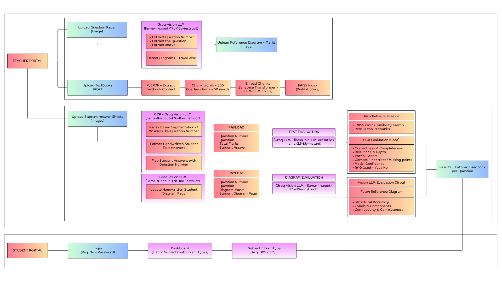

# ScriptSense 📝

> **AI-powered automated grading system for student answer sheets.**  
> Teachers upload question papers, answer sheets, and textbooks — students log in to view their AI-evaluated feedback and marks. All uploads are teacher-only.

---

## Table of Contents

1. [Overview](#overview)
2. [Architecture](#architecture)
3. [Tech Stack](#tech-stack)
4. [Project Structure](#project-structure)
5. [Prerequisites](#prerequisites)
6. [Environment Variables](#environment-variables)
7. [Installation & Setup](#installation--setup)
8. [Running the Application](#running-the-application)
9. [API Reference](#api-reference)
10. [Backend Modules](#backend-modules)
11. [Frontend Apps](#frontend-apps)
12. [Contributing](#contributing)

---

## Overview

ScriptSense automates the traditionally manual process of grading student answer sheets. The system consists of three main services:

| Service | Role | Port |
|---|---|---|
| **Django Backend** | Core AI grading engine, REST API | `8000` |
| **Teacher Frontend** | Upload question papers, answer sheets, and textbooks | `5173` |
| **Student Frontend** | Login, view feedback and marks per subject | `5174` |

**Key capabilities:**
- 📄 **Question Paper Upload** — Teachers define question papers as structured JSON (question text, marks, optional diagram marks + reference image) per subject and exam type. Stored in MongoDB.
- 🖼️ **Image-to-Text OCR** — Converts handwritten/scanned student answer sheet images to text using Groq's vision LLM (`llama-4-scout`).
- 🤖 **AI Grading** — Evaluates extracted answers against the question paper using a RAG-augmented Groq LLM chain (`llama-3.3-70b` → `llama-3.1-8b` fallback). Handles diagram detection, rate-limit retry, and per-question scoring.
- 📚 **RAG Textbook Pipeline** — Teachers upload PDF textbooks; the system chunks, embeds (`all-MiniLM-L6-v2`), and indexes them with FAISS for context-augmented grading.
- 💬 **Student Feedback** — Stores per-student, per-subject, per-exam-type feedback and marks in MongoDB. Students can log in with their USN to view results.

---

## Architecture



---

## Tech Stack

### Backend
| Technology | Version | Purpose |
|---|---|---|
| Python | 3.10+ | Runtime |
| Django | ≥ 5.1.4 | Web framework & REST API |
| django-cors-headers | ≥ 4.3.1 | Cross-origin request support |
| python-dotenv | ≥ 1.0.1 | Environment variable loading |
| pymongo | ≥ 4.6.1 | MongoDB driver |
| groq | ≥ 0.7.0 | Groq LLM & vision API |
| requests | ≥ 2.31.0 | HTTP calls |
| bcrypt | ≥ 4.1.2 | Student password hashing |
| sentence-transformers | ≥ 2.6.1 | Text embeddings for RAG |
| faiss-cpu | ≥ 1.8.0 | Vector similarity search |
| numpy | ≥ 1.26.4 | Numerical operations |
| PyPDF2 | ≥ 3.0.1 | PDF text extraction |

### Frontend (Both Apps)
| Technology | Version | Purpose |
|---|---|---|
| React | 18.x | UI library |
| TypeScript | 5.x | Type safety |
| Vite | 7.x | Build tool & dev server |
| Tailwind CSS | 3.x | Utility-first styling |
| React Router DOM | 6–7.x | Client-side routing |
| Lucide React | 0.344.x | Icon library |
| Axios | 1.x | HTTP client (Student app only) |

---

## Project Structure

```
Script-Sense/
├── .env                              # Real secrets (git-ignored)
├── .env.example                      # Template — copy this to .env
├── .gitignore
├── ScriptSense_System_Architecture.png
├── setup.bat                         # One-time dependency installer (Windows)
├── start_servers.bat                 # Launches all three servers (Windows)
├── README.md
│
├── Backend/
│   ├── manage.py
│   ├── requirements.txt
│   ├── db.sqlite3                    # SQLite DB (Django auth/admin only)
│   ├── Grader/                       # Django project core
│   │   ├── settings.py
│   │   ├── urls.py                   # Root URL routing
│   │   ├── wsgi.py
│   │   └── asgi.py
│   ├── Evaluate/                     # AI grading engine
│   │   ├── views.py                  # grade_questions(), evaluate_answer()
│   │   └── urls.py                   # POST /evaluate/script/
│   ├── ImagetoText/                  # OCR + end-to-end pipeline trigger
│   │   ├── views.py                  # process_exam_images()
│   │   └── urls.py                   # POST /imageto/text/
│   ├── RagPipe/                      # RAG pipeline
│   │   ├── views.py                  # ragify_pdf_view, similarity_search_view, serve_pdf_view
│   │   └── urls.py                   # POST /rag/pipeline/, /rag/search/, GET /rag/textbook/
│   ├── Student/                      # Student auth & feedback
│   │   ├── views.py                  # login, signup, feedback, sheets, subjects
│   │   └── urls.py                   # /student/login/, /signup/, /feedback/, /sheets/, /subjects/
│   ├── UploadQP/                     # Question paper ingestion
│   │   ├── views.py                  # upload_question_paper_json()
│   │   └── urls.py                   # POST /upload/upload_qp_json/
│   ├── Textbooks/                    # FAISS artifact storage (not a Django app)
│   │   ├── *.pdf
│   │   ├── *_index.faiss
│   │   └── *_meta.pkl
│   └── venv/                         # Python virtual environment (git-ignored)
│
└── Frontend/
    ├── TeacherFrontend/              # Teacher React app (port 5173)
    │   ├── src/
    │   │   ├── pages/
    │   │   │   ├── UploadQuestionPage.tsx   # Route: /
    │   │   │   ├── UploadAnswerPage.tsx     # Route: /upload_answer
    │   │   │   └── UploadTextbookPage.tsx   # Route: /upload_textbook
    │   │   └── components/
    │   │       ├── Header.tsx
    │   │       ├── Button.tsx
    │   │       ├── FileUpload.tsx
    │   │       ├── QuestionItem.tsx
    │   │       └── ResultCard.tsx
    │   ├── vite.config.ts
    │   └── package.json
    └── StudentFrontend/              # Student React app (port 5174)
        ├── src/
        │   ├── pages/
        │   │   ├── Login.tsx           # Route: /login
        │   │   ├── Register.tsx        # Route: /register
        │   │   ├── Dashboard.tsx       # Route: /dashboard (protected)
        │   │   └── SubjectDetail.tsx   # Route: /subject/:subject (protected)
        │   ├── components/
        │   │   ├── Layout.tsx
        │   │   ├── Navbar.tsx
        │   │   ├── ProtectedRoute.tsx
        │   │   └── LoadingSpinner.tsx
        │   ├── contexts/
        │   │   └── AuthContext.tsx     # USN-based auth state (localStorage)
        │   └── services/
        │       └── api.ts             # Axios client for /student/* endpoints
        ├── vite.config.ts
        └── package.json
```

---

## Prerequisites

Before you begin, ensure the following are installed on your system:

| Requirement | Minimum Version | Notes |
|---|---|---|
| **Python** | 3.10+ | [python.org](https://www.python.org/downloads/) |
| **Node.js** | v18+ | [nodejs.org](https://nodejs.org/) — includes `npm` |
| **MongoDB** | 6.0+ | Running locally on `mongodb://localhost:27017` — [mongodb.com](https://www.mongodb.com/try/download/community) |
| **Groq API Key** | — | Free at [console.groq.com](https://console.groq.com) |

> **Windows note:** The provided `.bat` scripts require **CMD / PowerShell on Windows**. For Linux/macOS, run the steps manually (see below).

---

## Environment Variables

All configuration lives in a single `.env` file at the project root.

### Setup

```bash
# Copy the example file
copy .env.example .env     # Windows
cp .env.example .env       # Linux / macOS
```

Then open `.env` and fill in your values.

### Variables Reference

| Variable | Required | Default | Description |
|---|---|---|---|
| `SECRET_KEY` | ✅ Yes | — | Django secret key for cryptographic signing. Generate with: `python -c "from django.core.management.utils import get_random_secret_key; print(get_random_secret_key())"` |
| `DEBUG` | No | `True` | Set to `False` in production to disable debug pages |
| `GROQ_API_KEY` | ✅ Yes | — | Groq API key — used by the Django backend for OCR and grading. Get one free at [console.groq.com](https://console.groq.com) |
| `VITE_GROQ_API_KEY` | ✅ Yes | — | Same Groq key exposed to the Teacher Vite frontend. Must be prefixed with `VITE_` for Vite to bundle it |
| `MONGO_URI` | No | `mongodb://localhost:27017` | MongoDB connection string. For Atlas: `mongodb+srv://<user>:<pass>@cluster.mongodb.net/<db>` |
| `OTHER_DJANGO_APP_URL` | No | `http://127.0.0.1:8000/evaluate/script/` | Internal URL for the evaluate endpoint. Only change if Django runs on a different port |
| `OTHER_APP_URL` | No | `http://127.0.0.1:8000/student/feedback/` | Internal URL for the student feedback endpoint. Only change if Django runs on a different port |

> ⚠️ **Security**: Never commit your real `.env` file. It is listed in `.gitignore`. Only commit `.env.example`.

---

## Installation & Setup

### Quick Setup (Windows)

```bat
git clone https://github.com/Tej-Gowda-26/Script-Sense.git
cd Script-Sense
copy .env.example .env
```

Edit `.env` with your `GROQ_API_KEY`, then run:

```bat
setup.bat
```

`setup.bat` will:
1. Create a Python virtual environment in `Backend/venv/`
2. Install all Python dependencies from `Backend/requirements.txt`
3. Run `npm install` for the Teacher Frontend
4. Run `npm install` for the Student Frontend

### Manual Setup (Linux / macOS)

```bash
git clone https://github.com/Tej-Gowda-26/Script-Sense.git
cd Script-Sense

# Copy and configure environment
cp .env.example .env
# Edit .env with your values

# Backend
cd Backend
python -m venv venv
source venv/bin/activate
pip install -r requirements.txt
cd ..

# Teacher Frontend
cd Frontend/TeacherFrontend
npm install
cd ../..

# Student Frontend
cd Frontend/StudentFrontend
npm install
cd ../..
```

---

## Running the Application

### Quick Start (Windows)

```bat
start_servers.bat
```

This opens three separate terminal windows — one per service.

### Manual Start

Open three separate terminals and run:

**Terminal 1 — Django Backend**
```bash
cd Backend
# Windows:
venv\Scripts\activate
# Linux/macOS:
source venv/bin/activate

python manage.py runserver
```

**Terminal 2 — Teacher Frontend**
```bash
cd Frontend/TeacherFrontend
npm run dev
```

**Terminal 3 — Student Frontend**
```bash
cd Frontend/StudentFrontend
npm run dev
```

### Access the App

| Service | URL |
|---|---|
| Django Backend / Admin | http://127.0.0.1:8000 |
| Teacher Frontend | http://localhost:5173 |
| Student Frontend | http://localhost:5174 |

---

## API Reference

All API endpoints are served by the Django backend at `http://127.0.0.1:8000`.

### UploadQP
| Method | Endpoint | Description |
|---|---|---|
| `POST` | `/upload/upload_qp_json/` | Upload a question paper as structured JSON. Fields: `questions` (JSON list), `exam_type`, `subject`. Optional per-question: `diagram_marks` + `image_<qno>` file. Upserts one document per subject/exam_type in MongoDB. |

### ImagetoText
| Method | Endpoint | Description |
|---|---|---|
| `POST` | `/imageto/text/` | Full end-to-end pipeline trigger. Accepts answer sheet images, runs OCR via Groq vision, calls the RAG context lookup and grading engine, and saves results to MongoDB. |

### Evaluate
| Method | Endpoint | Description |
|---|---|---|
| `POST` | `/evaluate/script/` | Grades a list of questions with student answers. Used internally by `ImagetoText`. Supports model chain fallback and rate-limit retry. |

### RagPipe
| Method | Endpoint | Description |
|---|---|---|
| `POST` | `/rag/pipeline/` | Upload and index a PDF textbook. Chunks text, generates embeddings with `all-MiniLM-L6-v2`, and saves a FAISS index + metadata pickle to `Backend/Textbooks/`. |
| `POST` | `/rag/search/` | Similarity search — retrieve top-k relevant chunks from a FAISS index for a query string. |
| `GET` | `/rag/textbook/` | Serve a stored textbook PDF file for preview. |

### Student
| Method | Endpoint | Description |
|---|---|---|
| `POST` | `/student/signup/` | Register a new student. Body: `{ usn, password }`. USN must match format `YYETDDnnnrrr`. Password is hashed with bcrypt. |
| `POST` | `/student/login/` | Authenticate a student. Body: `{ usn, password }`. Returns success on valid credentials. |
| `POST` | `/student/subjects/` | Get list of subjects with graded results for a USN. Body: `{ usn }`. |
| `GET/POST` | `/student/feedback/` | Retrieve or save per-student feedback and marks. Query params (GET): `usn`, `subject`, `exam_type`. |
| `GET` | `/student/sheets/` | Retrieve stored answer sheet images for a student. Query params: `usn`, `subject`, `exam_type`. |

### Django Admin
| Method | Endpoint | Description |
|---|---|---|
| `GET` | `/admin/` | Built-in Django admin panel |

---

## Backend Modules

| Module | Path | Purpose |
|---|---|---|
| **Grader** | `Backend/Grader/` | Django project core — settings (env loading, CORS, upload limits), root URL config, WSGI/ASGI |
| **UploadQP** | `Backend/UploadQP/` | Accepts JSON-structured question papers with optional per-question reference diagram images. Upserts into MongoDB `QuestionPaper` collection. |
| **ImagetoText** | `Backend/ImagetoText/` | End-to-end pipeline: OCR via Groq vision LLM → RAG context fetch → AI grading → save feedback. Orchestrates all other modules directly (no HTTP round-trips). |
| **RagPipe** | `Backend/RagPipe/` | PDF → chunked text → `all-MiniLM-L6-v2` embeddings → FAISS IndexFlatIP. Provides `get_rag_context()` for use by the grading engine. Chunks below a relevance threshold (`0.30`) are discarded. |
| **Evaluate** | `Backend/Evaluate/` | Core grading logic. Uses a Groq LLM chain (`llama-3.3-70b` → `llama-3.1-8b` on rate-limit). Detects diagram-only questions, injects RAG context (up to 4,000 chars), and handles 429 retry with parsed back-off. |
| **Student** | `Backend/Student/` | Handles student registration/login (bcrypt), feedback storage, answer sheet retrieval, and subject listing. Uses MongoDB `students` and `Login` collections with compound indexes. |
| **Textbooks** | `Backend/Textbooks/` | Static artifact directory (not a Django app). Stores raw PDF files alongside their FAISS index (`*_index.faiss`) and metadata pickle (`*_meta.pkl`) generated by RagPipe. |

---

## Frontend Apps

### Teacher Frontend (`Frontend/TeacherFrontend`) — Port 5173

The teacher-facing interface with three pages:

| Route | Page | What it does |
|---|---|---|
| `/` | **Upload Question Paper** | Define a question paper: add questions with text, marks, and optional diagram marks + reference image. Submit to `/upload/upload_qp_json/`. |
| `/upload_answer` | **Upload Answer Sheets** | Upload scanned/photographed student answer sheet images. Triggers the full OCR → grading → feedback pipeline via `/imageto/text/`. |
| `/upload_textbook` | **Upload Textbook** | Upload a PDF textbook to build a RAG index via `/rag/pipeline/`. Manage multiple indexed textbooks; set one as active for grading context. |

Built with **React + TypeScript + Vite + Tailwind CSS**.  
Uses `VITE_GROQ_API_KEY` from `.env` for any direct Groq calls.

### Student Frontend (`Frontend/StudentFrontend`) — Port 5174

The student-facing portal with authentication and results viewing:

| Route | Page | What it does |
|---|---|---|
| `/login` | **Login** | USN + password login. Stores USN in `localStorage` via `AuthContext`. Redirects to dashboard on success. |
| `/register` | **Register** | New student registration with USN and password. |
| `/dashboard` | **Dashboard** *(protected)* | Shows all subjects/exam types for which the logged-in student has graded results. |
| `/subject/:subject` | **Subject Detail** *(protected)* | Displays per-question feedback, marks scored vs. total, and answer sheet images for a specific subject and exam type. |

Built with **React + TypeScript + Vite + Tailwind CSS + Axios**.  
Auth state is managed via `AuthContext` (USN persisted in `localStorage`). All `/dashboard` and `/subject/*` routes are protected by `ProtectedRoute`.

---

## Contributing

1. **Fork** the repository.
2. Create a feature branch: `git checkout -b feature/my-feature`
3. Commit your changes: `git commit -m "feat: add my feature"`
4. Push to your fork: `git push origin feature/my-feature`
5. Open a **Pull Request** against `main`.

### Development Notes

- Keep secrets out of source control — use `.env.example` for documentation.
- Backend CORS is currently open (`CORS_ALLOW_ALL_ORIGINS = True`) — restrict `ALLOWED_HOSTS` and CORS origins before deploying to production.
- Set `DEBUG=False` and rotate `SECRET_KEY` before any public deployment.
- Max upload size is **50 MB** (configurable via `DATA_UPLOAD_MAX_MEMORY_SIZE` in `settings.py`).
- USN format is validated server-side against the pattern `YYETDDnnnrrr` (e.g. `22ETIS411050`).
- The Groq vision model chain is currently `["meta-llama/llama-4-scout-17b-16e-instruct"]`; the text grading chain falls back from `llama-3.3-70b-versatile` → `llama-3.1-8b-instant` on rate-limit (429).